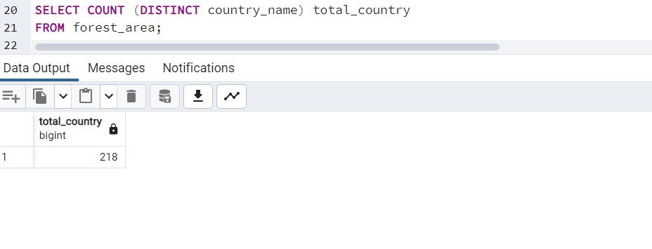
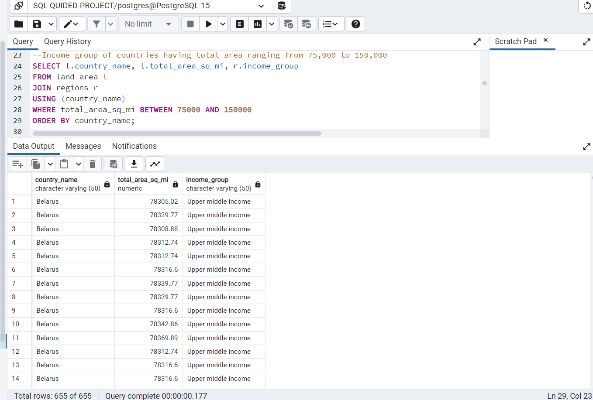
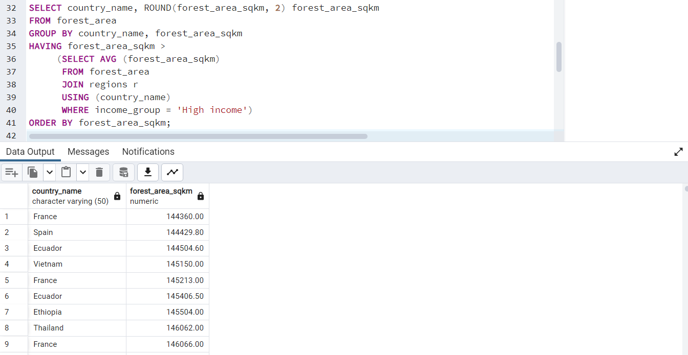
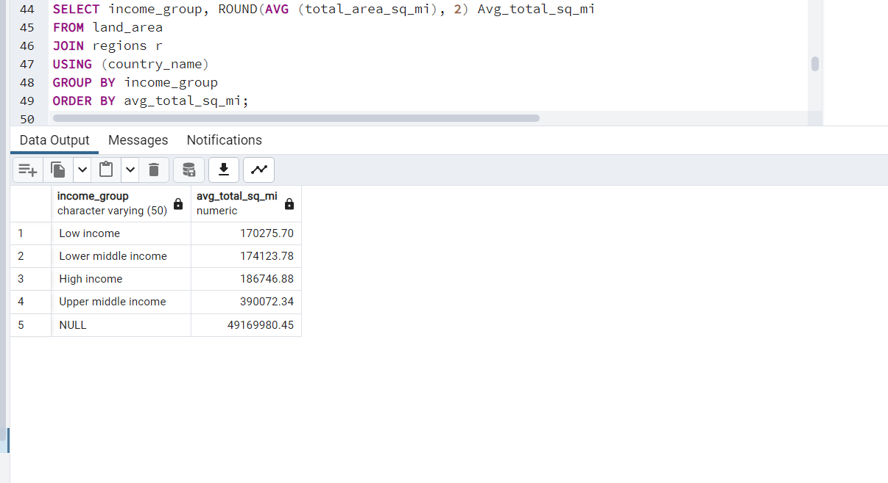
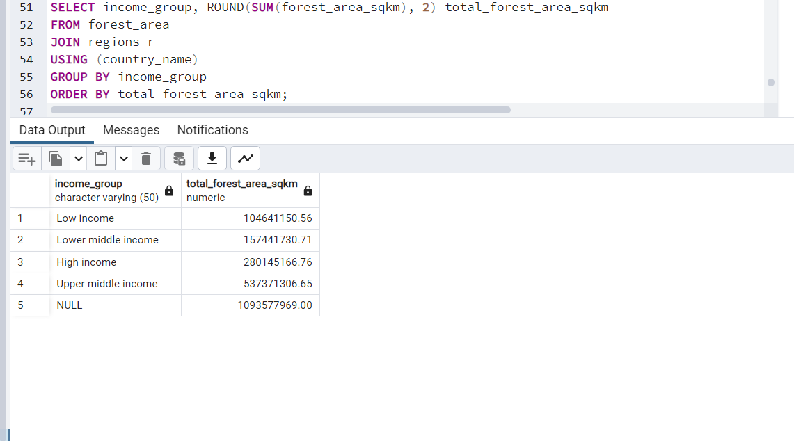
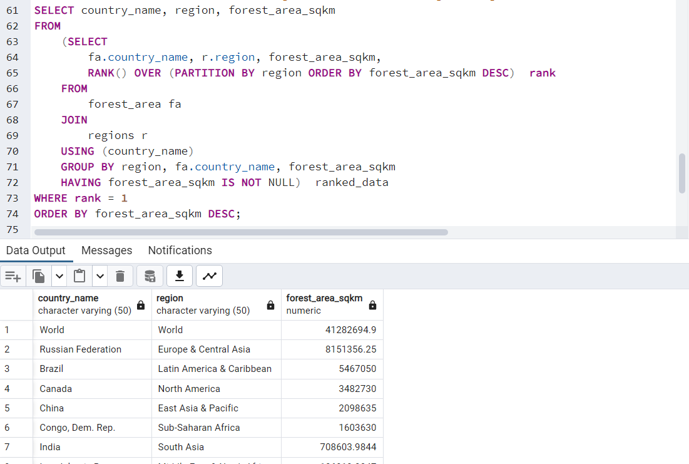

# Deforestation-Analysis

** Find the total number of countries involved in deforestation. 

Show the income groups of countries having total area ranging from 75,000 to 150,000.

Retrieve the names of countries that have a forest area (in square kilometers) greater than the average forest area of all countries in the "High Income" income group.

Calculate the average total area (in square miles) for countries in the "Upper Middle Income" income group and compare the result with the rest of the income categories.
                

Determine the total forest area (in square kilometers) for countries in the "High Income" income group and compare it with the other income categories. 

What are the countries from each region or continent having the highest total forest area?

