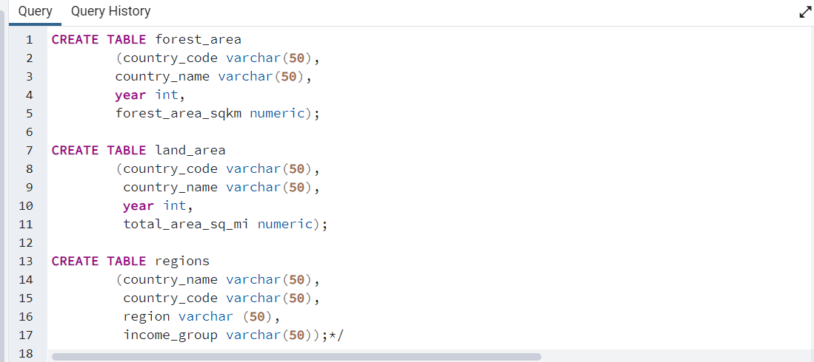

# Deforestation-Analysis

# Introduction
This is the SQL guided project for the Data Analysis cohort 3 training organised by Cinonso Promise and Somadina Victor. The SQL module was facilitated by Somadina Victor. This project is aimed at testing the knowledge of the trainee on basic and advanced SQL statements and queries to gain insights and make informed decisions. 

# Skills Demonstrated 
Knowledge and use of 
- Aggregate functions (SUM, AVG)
- Sorting and filtering (WHERE, HAVING, ORDER BY)
- Sub query
- Joins
- Window funtions
- Logical and Comparison operators

# Dataset
Trainees were provided with 3 datasets namely - forest_area, land_area, regions.

# Problem Statement 

1. Find the total number of countries involved in deforestation.
2. Show the income groups of countries having total area ranging from 75,000 to 150,000?
3. Retrieve the names of countries that have a forest area (in square kilometers) greater than the average forest area of all countries in the "High Income" income group.
4. Calculate the average total area (in square miles) for countries in the "Upper Middle Income" income group? compare the result with the rest of the income categories.
5. Determine the total forest area (in square kilometers) for countries in the "High Income" income group? Also compare with the other income categories.
6. What are the countries from each region or continent having the highest total forest area??

# Data Analysis 
First, I created a table and imported the csv files into my POSTGRES server.
ADD IMAGE OF YOUR CREATE TABLE

**1. Find the total number of countries involved in deforestation.** 

**2. Show the income groups of countries having total area ranging from 75,000 to 150,000.**

**3. Retrieve the names of countries that have a forest area (in square kilometers) greater than the average forest area of all countries in the "High Income" income group.**

**4. Calculate the average total area (in square miles) for countries in the "Upper Middle Income" income group and compare the result with the rest of the income categories.**

                

**5. Determine the total forest area (in square kilometers) for countries in the "High Income" income group and compare it with the other income categories.** 

**6. What are the countries from each region or continent having the highest total forest area?**

